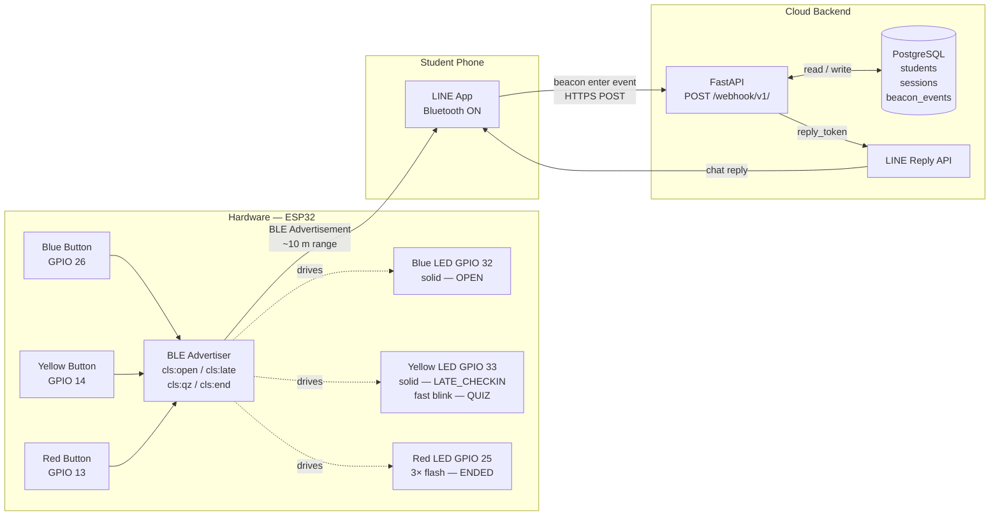
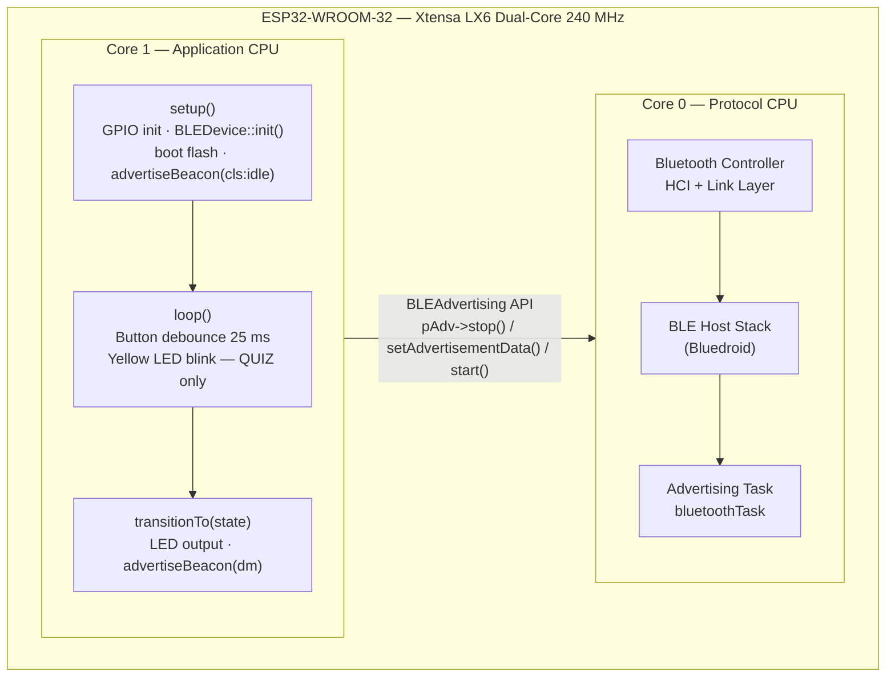
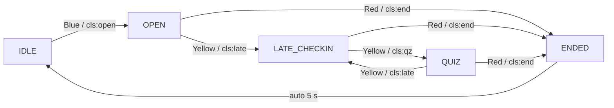

# Smart Classroom Attendance via LINE Beacon

**Author:** Shalong Samretnagn

ESP32-based smart attendance system for classrooms using BLE LINE Beacon and FastAPI. Students are identified automatically through their LINE `userId` and marked Present, Late, or Absent by session state — no app install, no QR code. The lecturer controls the session with 3 physical buttons. The backend uses FastAPI and PostgreSQL to process webhooks, register students, and push attendance status and quiz links via LINE Reply API.

Licensed under Apache License 2.0.

---

## Architecture Overview

### System Flow



### ESP32 Dual-Core Architecture



### Session State Machine



### Button & LED Reference

| Button | GPIO | State transition | LED (GPIO) | Beacon payload | Student status |
|---|---|---|---|---|---|
| Blue | 26 | IDLE → OPEN | Blue 32 solid ON | `cls:open` | PRESENT |
| Yellow | 14 | OPEN → LATE_CHECKIN | Yellow 33 solid ON | `cls:late` | LATE (if not already checked in) |
| Yellow | 14 | LATE_CHECKIN → QUIZ | Yellow 33 fast blink 5 Hz | `cls:qz` | QUIZ |
| Red | 13 | any → ENDED | Red 25 × 3 flash | `cls:end` | ABSENT (unmarked students) |

---

## How Student Check-In Works

LINE fires a `beacon enter` event the **first time** the phone detects the beacon in a given session. If a student is already in range when the session changes state, they will **not** automatically receive the new message.

**To get the ✅ Present message:**
1. Make sure you are in range (~10 m) of the ESP32 when the blue LED is on (OPEN state)
2. If you were already in range before the lecturer pressed the button — walk out of range and walk back, **or** toggle Bluetooth off then on

**If you leave the room and come back:**
- LINE fires another `enter` event when you return
- Both events are stored in the full beacon log
- Your **official attendance status is set by the first event** (earliest timestamp) — subsequent re-entries are recorded for the audit trail only

---

## Quick Start

### 1. Prerequisites

- Python ≥ 3.12, [uv](https://github.com/astral-sh/uv), PostgreSQL 17
- Arduino IDE with ESP32 board package
- LINE OA channel (Messaging API) + LINE Manager account

### 2. Clone & bootstrap

```bash
git clone <repo>
cd EMBSYS_LINE_CLASSROOM
make setup
```

### 3. Configure environment

```bash
cp .env.example .env
# fill in: DATABASE_URL, LINE_CHANNEL_SECRET, LINE_CHANNEL_ACCESS_TOKEN, LECTURER_TOKEN
```

### 4. Set up LINE Beacon

> Full guide: https://developers.line.biz/en/docs/messaging-api/using-beacons/#getting-beacon

**Step 1 — Link beacon with your bot account**
1. Go to [LINE Manager → Beacon](https://manager.line.biz/beacon/register)
2. Click **Link beacons with bot account**
3. Select your OA (e.g. **scool.BEACON**) → **Select**

**Step 2 — Issue a hardware ID**
1. Click **Issue LINE Simple Beacon hardware IDs**
2. Select your OA → **Issue hardware ID**
3. Copy the 10-character hex HWID (e.g. `018f62bd52`)
4. Add it to `.env`: `LINE_BEACON_HWID=018f62bd52`

**Step 3 — Flash ESP32**
1. Open `esp32/src/case01/case01.ino` in Arduino IDE
2. Verify the `LINE_HWID` bytes match your issued HWID
3. Flash to ESP32

### 5. Start the backend

```bash
cd line
uv run uvicorn src.main:app --reload --port 8000
```

### 6. Expose via ngrok & set webhook

```bash
ngrok http 8000
```

In [LINE Developers Console](https://developers.line.me/console/) → Messaging API → Webhook URL:
```
https://<your-ngrok-id>.ngrok-free.app/webhook/v1/
```
Enable **Use webhook** → **Verify** (expect 200 OK).

### 7. Pre-schedule a session (lecturer)

Before pressing the blue button, create a session via the API so the time window is known:

```bash
curl -X POST -H "Authorization: Bearer <LECTURER_TOKEN>" \
  -H "Content-Type: application/json" \
  -d '{
    "label": "Week 12 — Real-Time Systems",
    "start_time": "2026-04-20T09:00:00+07:00",
    "end_time":   "2026-04-20T11:00:00+07:00",
    "slides_url": "bit.ly/emb-w12",
    "supplementary_url": "bit.ly/emb-w12-ref"
  }' \
  http://localhost:8000/api/v1/sessions/
```

If the blue button is pressed without a pre-scheduled session, a walk-in session is created automatically (students see a note in their reply).

### 8. Test

Open Swagger UI at `http://localhost:8000/docs`, click 🔒 **Authorize**, paste `LECTURER_TOKEN`.

Send **Hello** to your LINE OA — the bot should reply with a greeting.

---

## Hardware

| Component | GPIO | Role |
|---|---|---|
| Blue button | 26 | Start class (IDLE → OPEN) |
| Yellow button | 14 | Open late check-in (OPEN → LATE_CHECKIN) / start quiz (LATE_CHECKIN → QUIZ) |
| Red button | 13 | End class (any → ENDED) |
| Blue LED | 32 | Solid — session OPEN |
| Yellow LED | 33 | Solid — LATE_CHECKIN / fast blink 5 Hz — QUIZ |
| Red LED | 25 | 3× flash — session ENDED |

---

Sessions are pre-scheduled by the lecturer via `POST /api/v1/sessions/` with a Bangkok-time window.
The backend resolves the active session at event time — the ESP32 does not carry a session ID.

See `docs/` for full business case, API design, and conceptual diagrams.
