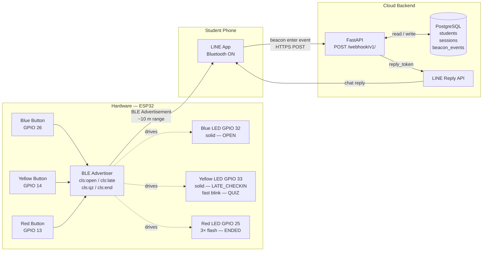
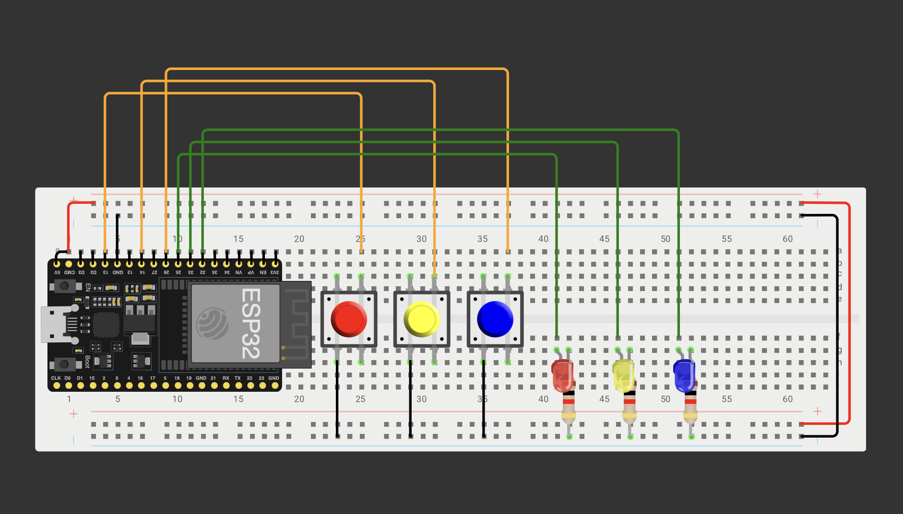
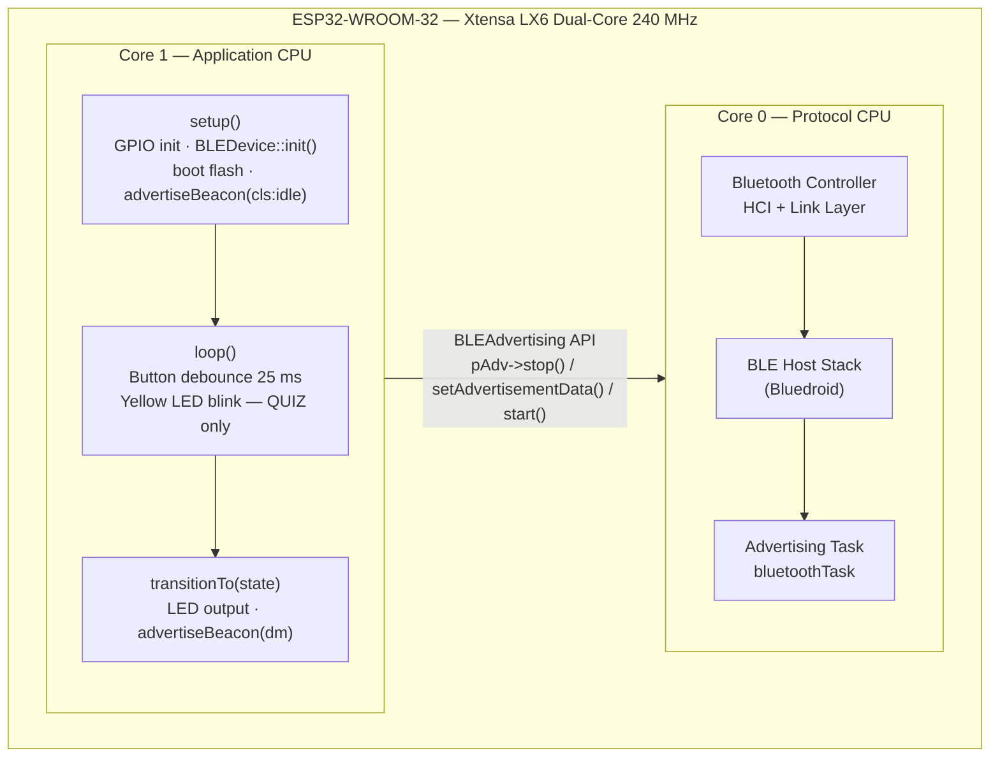
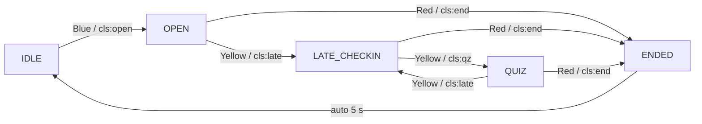

# Smart Classroom Attendance via LINE Beacon
## Project Report — Embedded & Real-Time Systems (2110682)

**Author:** Shalong Samretnagn (6570047721)  
**Date:** April 23, 2026

---

## 1. Introduction

Traditional classroom attendance relies on paper sign-in sheets, roll calls, or QR-code scans — all of which require deliberate action from every student and introduce friction that disrupts the start of class. This project replaces that process with a **passive, proximity-based system** built on an ESP32 microcontroller and the LINE Simple Beacon standard.

The core idea is straightforward: the lecturer presses one physical button to open the attendance window. The ESP32 starts broadcasting a Bluetooth Low Energy (BLE) advertisement. Every student's LINE app detects the beacon automatically when they walk into the room and reports it to the backend. No app install, no QR code, no student action required.

The result is a system where attendance, late marking, quiz distribution, and session closure are all driven by three buttons on a piece of hardware sitting on the lecturer's desk — with no manual data entry and no student-facing interface beyond the LINE chat messages students already receive.

A cloud backend (FastAPI + PostgreSQL) exists in this project to process the LINE webhook events and persist attendance records, but it is intentionally thin. The intelligence of the system lives in the hardware state machine and the BLE advertisement payload. The backend simply interprets the payload tag it receives and acts accordingly.

---

## 2. System Architecture Overview

The overall data flow moves from physical hardware, through BLE radio, to student phones, and finally to the cloud backend.



Three actors are involved: the **lecturer** (operates the hardware), **students** (carry phones with LINE installed), and the **backend** (validates events and sends replies). The ESP32 is the bridge between the physical classroom and the digital record.

---

## 3. Hardware Design

### 3.1 Component Overview

The hardware comprises an ESP32-WROOM-32 development board, three momentary push buttons, and three LEDs — one per colour. Each button corresponds to a session transition, and each LED provides immediate visual confirmation of the current session state.

| Component | GPIO | Role |
|---|---|---|
| Blue button | 26 | Start class (IDLE → OPEN) |
| Yellow button | 14 | Open late check-in / start quiz |
| Red button | 13 | End class (any state → ENDED) |
| Blue LED | 32 | Solid on — session OPEN |
| Yellow LED | 33 | Solid — LATE\_CHECKIN · fast blink 5 Hz — QUIZ |
| Red LED | 25 | 3× flash — session ENDED |

All buttons are wired with `INPUT_PULLUP` — the GPIO reads HIGH at rest and falls to LOW when pressed. This eliminates the need for external pull-up resistors and gives clean, deterministic logic levels.

### 3.2 Arduino Connection Diagram



---

## 4. CPU Architecture and How the Code Maps to Hardware

This section is the core of the report. Understanding how the ESP32's dual-core processor is used — and how the firmware divides responsibility between software and hardware — explains why the system behaves as a real-time device rather than just a microcontroller running a loop.

### 4.1 ESP32 Dual-Core Architecture

The ESP32-WROOM-32 contains an Xtensa LX6 dual-core processor running at up to 240 MHz. The two cores have distinct default responsibilities:



**Core 0** hosts the entire Bluetooth stack — the HCI controller, the BLE link layer, and the Bluedroid host. This runs continuously and autonomously once started. The application code never touches these internals directly.

**Core 1** runs `setup()` and `loop()` — the standard Arduino execution model. All application logic lives here: reading buttons, updating LEDs, and calling the BLE Advertising API to change what Core 0 is broadcasting.

The two cores communicate through the `BLEAdvertising` API: Core 1 calls `pAdv->stop()`, rewrites the advertisement payload, and calls `pAdv->start()`. Core 0 picks up the new payload and begins transmitting it. From the perspective of a student's phone, the beacon content changes atomically between one packet and the next.

### 4.2 GPIO Initialisation in `setup()`

On boot, `setup()` runs once on Core 1:

```cpp
for (int i = 0; i < 3; i++) {
    pinMode(btnPins[i], INPUT_PULLUP);  // buttons — active LOW
    pinMode(ledPins[i], OUTPUT);
    digitalWrite(ledPins[i], LOW);
}
// Boot flash — confirms LED wiring
for (int i = 0; i < 3; i++) digitalWrite(ledPins[i], HIGH);
delay(300);
for (int i = 0; i < 3; i++) digitalWrite(ledPins[i], LOW);

BLEDevice::init("scool-beacon-01");
pAdv = BLEDevice::getAdvertising();
pAdv->setMinInterval(160);   // 100 ms (units of 0.625 ms)
pAdv->setMaxInterval(160);
advertiseBeacon("cls:idle");
```

Three things happen here: GPIO modes are configured, BLE is initialised with a fixed device name, and the advertising interval is set to 100 ms (160 × 0.625 ms). The 100 ms interval is important — it means a student's phone can detect the beacon within a fraction of a second of entering range.

### 4.3 Button Debounce in `loop()`

The `loop()` function runs continuously on Core 1. Its primary job is debouncing the three buttons and dispatching state transitions:

```cpp
for (int i = 0; i < 3; i++) {
    bool raw = digitalRead(btnPins[i]);
    if (raw != lastRaw[i]) { lastRaw[i] = raw; lastChange[i] = now; }

    if ((now - lastChange[i]) >= 25 && raw != lastStable[i]) {
        lastStable[i] = raw;
        if (raw == LOW) {
            // dispatch based on index i and current sessionState
        }
    }
}
```

The debounce window is 25 ms. A button press is only registered after the GPIO signal has been stable for 25 milliseconds — this eliminates contact bounce that would otherwise trigger multiple state transitions from a single press. The implementation uses per-button timestamps (`lastChange[]`) and a separate record of the last confirmed stable level (`lastStable[]`), making it non-blocking: the main loop continues polling all three buttons without any `delay()` call.

### 4.4 BLE Advertisement Construction

The `advertiseBeacon()` function is where firmware behaviour maps directly to radio output. It constructs a raw BLE advertisement packet conforming to the LINE Simple Beacon specification:

```
[Flags AD]  [UUID list AD 0xFE6F]  [Service Data AD]
                                        │
                                        ├── UUID:    0xFE6F (LINE Corp)
                                        ├── Sub-type: 0x02 (Simple Beacon)
                                        ├── HWID:    5 bytes (registered with LINE OA)
                                        ├── TX Power: 0x7F
                                        └── dm:      up to 13 bytes (session tag)
```

The `dm` (device message) field is the variable part. The firmware writes one of five values:

| `dm` value | Session state | Meaning to backend |
|---|---|---|
| `cls:idle` | IDLE | Ignore — no session active |
| `cls:open` | OPEN | Mark student PRESENT |
| `cls:late` | LATE\_CHECKIN | Mark student LATE |
| `cls:qz` | QUIZ | Push quiz link to student |
| `cls:end` | ENDED | Session closed |

The HWID bytes `{ 0x01, 0x8F, 0x62, 0xBD, 0x52 }` are hardcoded in firmware and registered in LINE Official Account Manager — this is what ties a specific ESP32 unit to a specific LINE bot account.

### 4.5 State Machine and `transitionTo()`

The session state is held in a single enum variable:

```cpp
enum State { IDLE, OPEN, LATE_CHECKIN, QUIZ, ENDED };
State sessionState = IDLE;
```

The `transitionTo()` function handles every state change. It drives the LEDs, calls `advertiseBeacon()` to update the radio payload, and — for the ENDED state — includes a 5-second blocking delay so that `cls:end` remains visible to any phones still in range before the beacon reverts to `cls:idle`:



The Yellow LED has two behaviours that are driven differently: in LATE\_CHECKIN state it is set solid (`digitalWrite(ledPins[1], HIGH)`), while in QUIZ state the main loop toggles it every 100 ms using a timestamp comparison — producing the 5 Hz blink without a hardware timer or blocking delay.

---

## 5. User Journey

### 5.1 Lecturer Journey

The lecturer's entire interaction with the system is through three buttons. No computer, no app, no manual data entry.

```
Time     Lecturer action          LED state              What happens
──────────────────────────────────────────────────────────────────────────
T+0:00   Powers on ESP32          All LEDs off           Boot flash, cls:idle broadcast begins
T+0:05   Presses BLUE             Blue LED solid ON      cls:open broadcast begins
T+0:01   Students walk in         Blue solid             Each student's LINE receives "✅ Present!"
T+0:15   Presses YELLOW (1st)     Yellow LED solid ON    cls:late broadcast — latecomers marked LATE
T+0:45   Presses YELLOW (2nd)     Yellow LED fast blink  cls:qz broadcast — quiz links pushed
T+1:00   Presses RED              Red 3× flash → all off cls:end broadcast for 5 s → cls:idle
```

After the session, the lecturer can export attendance records as CSV via the admin API — but nothing in that export process requires touching the hardware again.

### 5.2 Student Journey

The student experience is entirely passive. The only prerequisite is that the student has added the LINE Official Account as a friend and has registered their student ID once by messaging it to the bot.

```
Student action                        What the system does
──────────────────────────────────────────────────────────────────────────
Opens LINE app (one-time setup)        —
Messages 10-digit student ID           Backend stores userId ↔ studentId mapping
Walks into classroom with phone        LINE app detects beacon, sends enter event to backend
                                       Backend logs attendance status from dm tag
                                       LINE Reply API pushes personalised message to student's chat
Receives LINE message                  "✅ Present! — Slides: bit.ly/emb-w12"
Leaves room and re-enters              Second enter event is logged but does not change status
                                       (first-event rule: earliest timestamp wins)
Session ends                           "Class has ended. Your status: PRESENT"
```

The student never knows the system is running. The only visible output is a LINE chat message — the same channel they use for everything else. There is no separate app to install, no QR code to scan, no NFC tap required.

### 5.3 Anti-Cheat Properties

The system's anti-cheat design flows directly from the hardware and protocol choices:

- **Physical proximity is enforced by BLE range (~10 m).** A student outside the room cannot trigger the beacon.
- **LINE `userId` is device-bound.** It is the internal identifier LINE assigns to an account on a specific device. Forwarding a screenshot or link to a friend does nothing — the `replyToken` is single-use and the `userId` is resolved server-side.
- **No shareable link exists.** The backend pushes replies directly to the student's own chat via the reply token — there is no URL for a student to forward.
- **Server-side deduplication.** If the same `userId` is detected twice in one session, only the first event is counted.

---

## 6. Backend (Brief Note)

The project includes a **FastAPI** application that handles the LINE webhook and persists attendance data to **PostgreSQL**. Its responsibilities are:

- Verify the `X-Line-Signature` header on every webhook request
- Parse the `dm` field from the beacon payload to determine session state
- Look up the registered student from `userId`
- Write an attendance record and reply via the LINE Reply API
- Expose lecturer admin endpoints for session listing, manual overrides, and CSV export

The backend is intentionally stateless with respect to the ESP32 — it does not know which GPIO state the hardware is currently in. It only knows what the `dm` tag says at the moment a beacon enter event arrives. The session state machine lives entirely on the hardware.

---

## 7. Conclusion

This project demonstrates how an embedded device with three buttons and three LEDs can replace a manual classroom administrative task with zero student effort. The key design insight is keeping the state machine on the hardware: the ESP32 firmware is the source of truth for what phase the class is in, and the BLE advertisement is the mechanism that propagates that state to every phone in the room simultaneously.

From an embedded systems perspective, the project puts into practice several course concepts within a single coherent application: GPIO input with software debounce, BLE peripheral programming, dual-core task partitioning, and a real-time constraint on the advertising period. The backend is a thin processing layer — it receives facts from the hardware and acts on them, but it does not direct the hardware.

The physical simplicity of the interface — three buttons, three LEDs — is intentional. Reliability and ease of use in a live classroom require that the lecturer can operate the device without looking away from the room.
